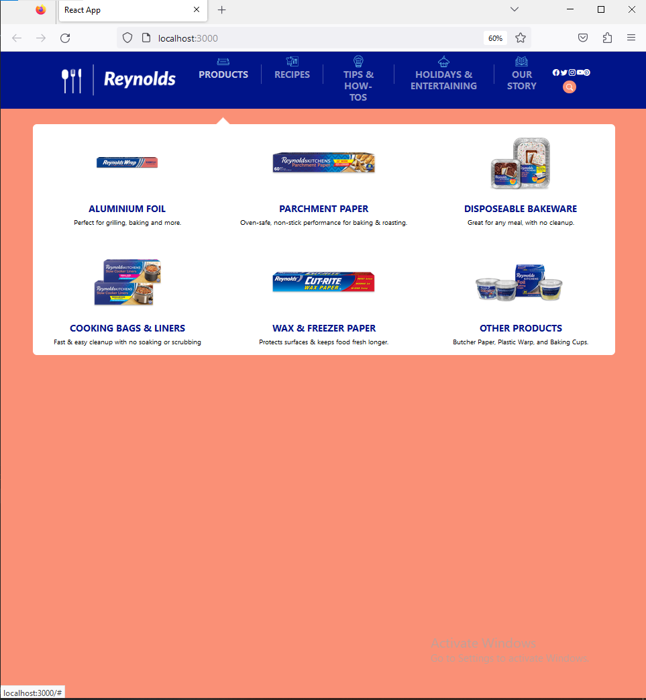
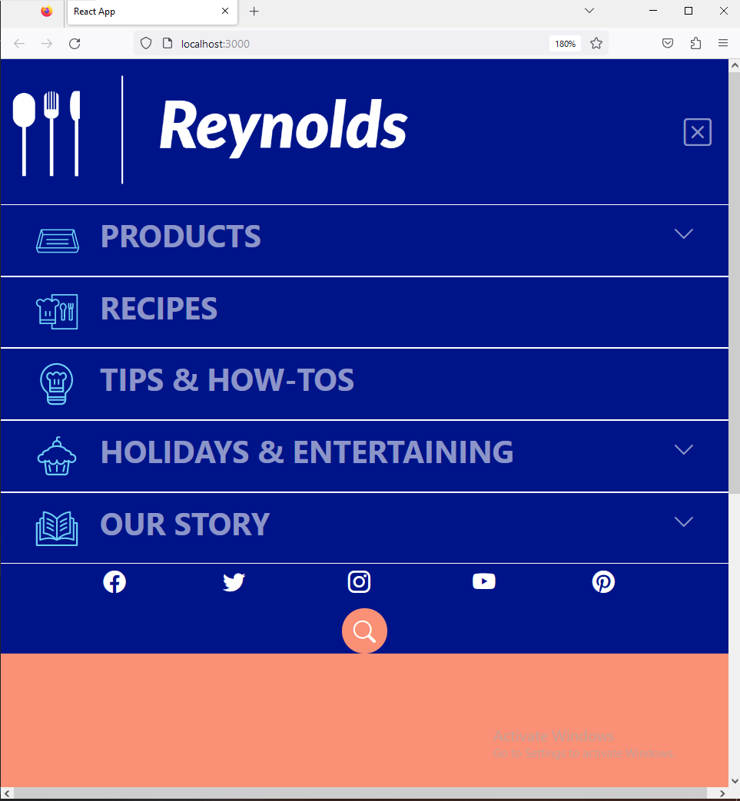

## Hi Peeps @ Exemplifi!
## Lets get started with Reynolds UI

# Screenshot Desktop

# Screenshot Mobile

# Running the Project
1. Clone the Repository -> Run the below command in cmd/terminal in a new directory
### `https://github.com/Neolokeshkr/Exemplifi-Reynolds-ReactApp.git`

2. Navigate to Project Directory
### `cd Exemplifi-Reynolds-ReactApp/`

3. Install Dependencies:
### `npm install`

4. Start the application:
### `npm start`

5.  Run the app in the development mode.\
    Open [http://localhost:3000](http://localhost:3000) to view it in your browser.

6. ### Hope you like it. Thanks!

## Notes
1. I have created this appliction using react-cra template.
2. I have used BS5 for stlyling along with css.
3. I have added react-popper library to show the product list on hover functionality.
4. Also i have included library for bootstrap-icons for SM icons and created a brand logo.
5. The application is responsive.

